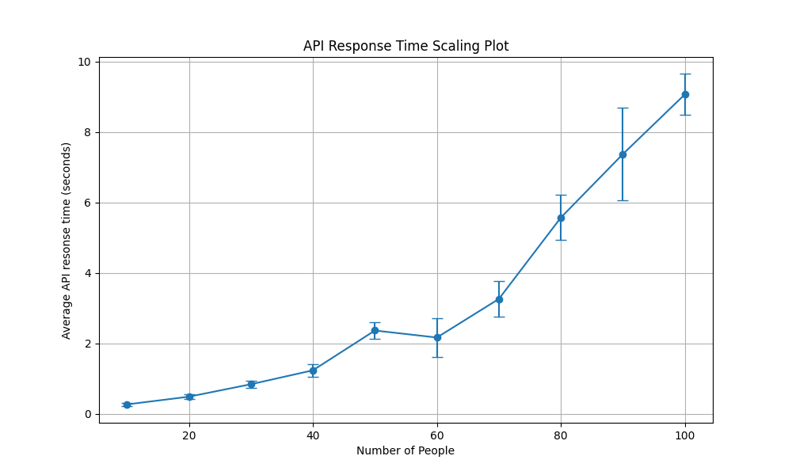

# Learn from friends API

See here for [learn-from-friends repo](https://github.com/rhotter/learn-from-friends)

## Running Locally

```bash
npm i -g vercel
vercel dev
```

Your Flask application is now available at `http://localhost:3000`.

## API Response Time


